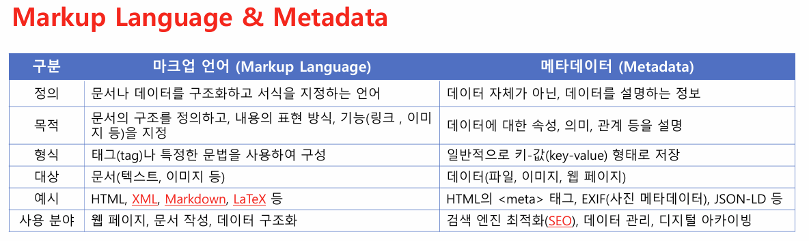
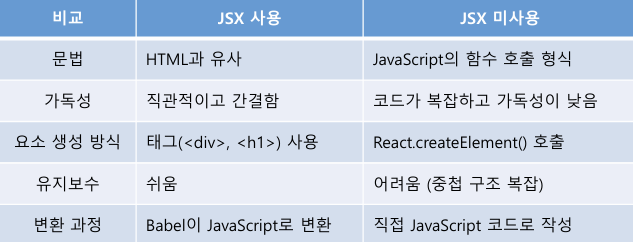

# 수업내용 (1주차)

## HTML

HTML은 (Hyper Text Markup Language)로 웹 페이지의 뼈대를 구성하기 위해 사용하는 마크업 언어 입니다.



## MPA vs SPA

1. MPA (Multi-Page Application)  
   **여러 개의 html 페이지로 구성된 전통적인 웹 애플리케이션**

장점

- SEO 친화적 (각 페이지마다 고유한 URL)
- 초기 로딩 속도가 빠름
- 보안성이 높음 (서버 측에서 렌더링됨)

단점

- 페이지 이동 시 **전체 페이지 새로고침**이 필요함
- 서버 요청이 많아 성능 저하 가능

---

2. SPA (Single-Page Application)
   **하나의 HTML 페이지에서 동적으로 콘텐츠를 변경하는 방식**

장점

- **빠른 속도** (페이지 전환 시 새로고침이 없음)
- 부드러운 사용자 경험 (UX)
- 서버 부하가 적고, API 활용이 용이

단점

- SEO 최적화가 어려움 (SSR 필요)
- 초기 로딩 속도가 느림 (번들 크기가 큼)
- 보안 문제 (클라이언트에서 많은 로직이 실행됨)

---

## CSS

CSS는 (Cascading Style Sheets)로 웹 페이지의 레이아웃과 글꼴 색상 등의 디자인을 입히는 역할입니다.

## Node.js

Node.js는 브라우저가 아닌 환경에서 JS를 실행할 수 있도록 해주는 런타임입니다.  
수업 기준으로 생각하면은 당장은

> "리액트를 실행하도록 도와주는 도구"

라고 생각하면 됩니다.

## IDE

IDE는 (Integrated Development Environment)로 소프트웨어 개발을 쉽게할 수 있도록 코드편집, 디버깅, 빌드, 실행 등의 기능을 하나의 프로그램에 통합한 개발도구입니다.

대표적으로 **Visual Studio**, **IntelliJ**, **PyCharm**, **VS Code** 등이 있습니다.

# React

## NPM vs NPX

| 구분               | npm (Node Package Manager)                                     | npx (Node Package eXecute)                        |
| ------------------ | -------------------------------------------------------------- | ------------------------------------------------- |
| 역할               | 패키지를 **설치**하고 관리하는 도구                            | 패키지를 **실행**하는 도구                        |
| 설치 여부          | 패키지를 글로벌(`-g`) 또는 로컬(`node_modules`)에 설치 후 사용 | 패키지를 설치하지 않고도 실행 가능                |
| 사용 목적          | 패키지 및 라이브러리 설치 (`npm install react`)                | 단발성 실행 (`npx create-react-app my-app`)       |
| 실행 방식          | 설치된 패키지를 실행 (`npm run <script>`)                      | 패키지 없이도 명령어 실행 (`npx <command>`)       |
| 사용 예시          | `npm install express` (설치)                                   | `npx eslint --init` (바로 실행)                   |
| 전역 설치 필요     | 필요할 수 있음 (`npm install -g <package>`)                    | 필요 없음 (자동으로 패키지 다운로드 후 실행)      |
| 주로 사용되는 경우 | 프로젝트 내에서 패키지를 지속적으로 사용할 때                  | 특정 패키지를 한 번 실행하거나, 최신 버전 실행 시 |

## 리액트 생성

리액트를 실행하는 대표적인 방법은 **2가지**가 있습니다.  
1️⃣ **CRA (Create React App) 방식**  
2️⃣ **Vite 방식**

## 1️⃣ CRA 방식 (현재는 비추천)

**CRA(Create React App)**는 기존에 많이 사용되던 방식이지만,  
현재 **Facebook(메타)**에서 더 이상 관리하지 않아 사용을 권장하지 않습니다.

🔹 **CRA 설치 명령어 (비추천)**

```shell
npx create-react-app react-app
```

## 2️⃣ Vite 방식 (최신 & 추천)

Vite는 최근 가장 많이 사용되는 빌드 도구로,

- React, Vue, Svelte, Angular 등 다양한 프레임워크를 지원
- TypeScript, ESLint까지 함께 설정 가능
- 빠른 개발 서버 및 빌드 속도 제공

🔹 Vite 설치 명령어

```shell
npm create vite@latest
```

개발자는 트렌드가 생명이기에, CRA는 더 이상 사용되지 않으며, **Vite**를 사용해야합니다.

## JSX

JSX는 (JavaScript XML)입니다.  
쉽게 말하여, HTML과 JavaScript를 결합한 문법입니다.



### JSX 장점

1. 가독성이 좋고 직관적임
2. 코드가 간결하고 유지보수가 쉬움
3. 자바스크립트와 자연스럽게 결합가능
4. 조건부 렌더링이 쉬움
5. 스타일 및 이벤트 핸들링이 쉬움
