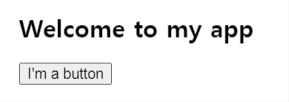
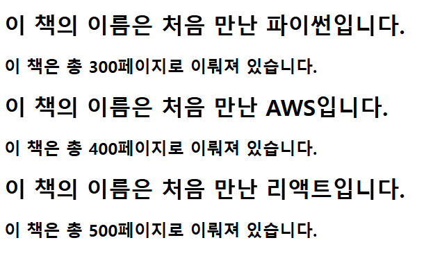
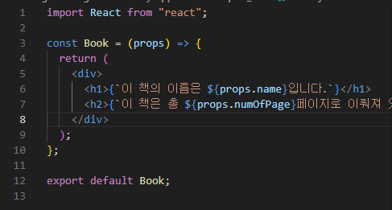
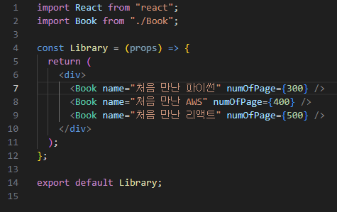

# 수업내용 (2주차)

## 복습

HTML

- 웹사이트의 뼈대를 구성하기 위해서 사용하는 마크업 언어
- 태그를 사용해서 웹사이트의 구조를 만듦

CSS

- 웹사이트의 레이아웃과 글꼴, 색상 등의 디자인을 입히는 역할을 하는 언어

JavaScript

- 웹페이지에서 동적인 부분을 구현하기 위한 스크립트 언어
- 정식명칭은 ECMAScript
- 웹사이트가 살아 움직이도록 생명을 불어넣는 역할
- 2015년 ES6가 나오면서 새로운 문법들이 많이 추가되었고, JS표준화의 발판이 마련

## 프레임워크와 라이브러리 차이

**프레임워크** : 흐름의 제어 권한을 개발자가 아닌 프레임워크가 가지고있다.  
**라이브러리** : 흐름에 대한 제어를 하지 않고 개발자가 필요한 부분만 필요할 때 가져다 사용하는 형태

## 리액트의 장점

1. Virtual DOM을 사용하여 빠른 업데이트와 렌더링 속도
2. 컴포넌트 기반 구조
3. 컴포넌트를 활용한 재사용성 및 유지보수 용이
4. 메타라는 든든한 지원군
5. 활발한 지식 공유 & 커뮤니티
6. 모바일 앱 개발 가능

## 리액트의 단점

1. 방대한 학습량
2. state 관리 복잡도

- state : 리액트 컴포넌트의 상태를 의미

## 리액트 실행법

```shell
npx create-react-app <your-project-name>
```

## Babel

1. Transform syntax (구문 변환)
2. babel-polyfill을 통해서 폴리필 기능 지원
3. JSX and React

## Webpack

JS로 만든 프로그램을 배포하기 좋은 형태로 묶어주는 도구

## 실습



```js
function MyButton() {
  return <button>I'm a button</button>;
}
export default function MyApp() {
  return (
    <div>
      <h1>Welcome to my app</h1>
      <MyButton />
    </div>
  );
}
```





## JSX 사용법

1. JSX 기본구조

- JSX에서는 HTML과 유사한 문법을 사용하여 요소를 반환할 수 있다.  
  JSX는 반드시 하나의 부모 요소로 감싸야 한다.

```js
function App() {
  return (
    <div>
      <h1>Hello, JSX!</h1>
      <p>React에서 JSX를 사용합니다.</p>
    </div>
  );
}
```

2. JSX에서 자바스크립트 표현식

- JSX 내부에서 JavaScript 표현식을 {}로 감싸서 사용할 수 있다.

```js
const name = "React";
function App() {
  return <h1>Hello, {name}!</h1>;
}
```

3. JSX에서 속성(props) 사용

- JSX에서는 HTML 속성과 유사한 방식으로 속성을 설정할 수 있지만, 일부 속성은 JavaScript 문법을 따른다.

```js
const imgUrl = "https://via.placeholder.com/150";
function App() {
  return ;
}
```

4. JSX에서 조건부 렌더링

- JSX에서는 삼항 연산자를 사용하여 조건부 렌더링을 구현할 수 있다.

```js
function App({ isAdmin }) {
  return (
    <div>
      <h1>Hello, User!</h1>
      {isAdmin && <p>관리자 권한이 있습니다.</p>}
    </div>
  );
}
```

5. JSX에서 반복문 사용 (배열과 map())

- JSX에서는 for문을 직접 사용할 수 없고, map() 메서드를 이용해 반복 렌더링을 해야 한다.

```js
const fruits = ["🍎 Apple", "🍌 Banana", "🍊 Orange"];
function App() {
  return (
    <ul>
      {fruits.map((fruit, index) => (
        <li key={index}>{fruit}</li>
      ))}
    </ul>
  );
}
```

6. JSX에서 이벤트 처리

- JSX에서는 이벤트를 onClick, onChange 등의 속성으로 설정할 수 있다.

```js
function App() {
  function handleClick() {
    alert("버튼이 클릭되었습니다!");
  }
  return <button onClick={handleClick}>Click Me</button>;
}
```
